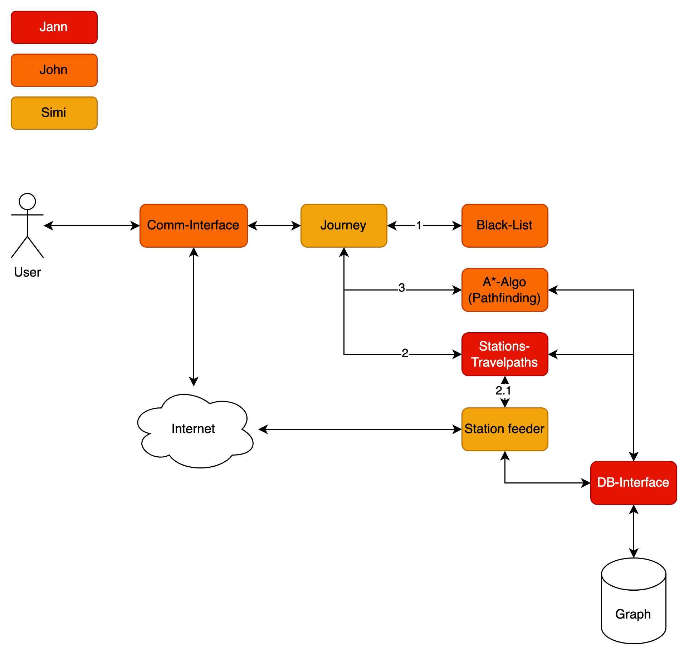

# Journey Planner

## Architecture



### Parts

* Comm-Interface
  * **Done by**: John
  * Description TBD
* Journey
  * **Done by**: Simone
  * TBD
* Black-List
  * **Done by**: John / Jann
  * TBD
* Pathfinding
  * **Done by**: John
  * TBD
* Station-Travelpaths
  * **Done by**: Jann
  * TBD
* Station-Feeder
  * **Done by**: Simone
  * TBD
* Database (Interface)
  * **Done by:** Jann
  * TBD

## Documentation

TBD: Other components

### Database

**Introduction**: In Graph databases, there are two types of data, that can be ingested: `nodes` and `edges`.
Edges symbolize Relationships between nodes. So nodes are our stations and edges are the train connections.

**Neo4J**: Neo4J has the possibility to create nodes with special `labels` these Labels can be used to group together nodes.
We can either use this to group stations to their countries, or group them by size or type. This can be discussed.
It also has the option to save [metadata](https://neo4j.com/docs/graph-data-science/current/management-ops/graph-write-to-neo4j/write-back-relationships/) associated with it.
This means we can save the distance and maybe the travel time for each train station connection within the database.

**Node-Schema**
```json
{
  "": "",
  "": ""
}
```

**Edge-Schema**
```json
{
  "": "",
  "": ""
}
```